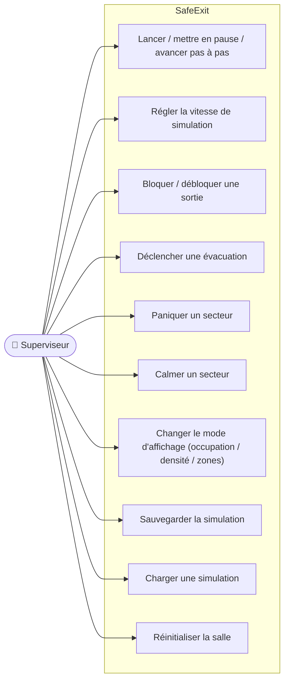

# SafeExit — Cas d'utilisation

Document exigé par le cahier des charges. L'acteur principal est le **superviseur** de la salle, qui pilote la simulation et la supervision depuis le tableau de bord.

## Acteur

- **Superviseur** — opérateur du poste de supervision. Observe l'occupation en temps réel et déclenche/annule des scénarios.
- *(Acteur secondaire implicite : le **système de capteurs**, qui alimente automatiquement l'affichage et les alertes.)*

## Vue d'ensemble des cas d'utilisation

## Scénarios détaillés

### UC1 — Piloter la simulation
- **But :** contrôler le déroulement temporel.
- **Scénario :** le superviseur clique *Play* (déroulement continu), *Pause*, ou *Step* (un cycle). À chaque cycle, le moteur avance chaque agent et la vue se rafraîchit.

### UC2 — Régler la vitesse
- **Scénario :** le superviseur déplace le curseur *Vitesse* ; l'intervalle entre deux cycles est ajusté en direct.

### UC3 — Bloquer / débloquer une sortie
- **But :** simuler une issue condamnée.
- **Scénario :** le superviseur clique sur le bouton d'une sortie (ou sur l'élément du graphe). La sortie passe *Bloquée* ; le routeur Voronoï **recalcule** les chemins d'évacuation vers les sorties restantes.

### UC4 — Déclencher une évacuation
- **But :** passer de la phase NORMALE à l'ÉVACUATION.
- **Scénario :** le superviseur clique *Déclencher évacuation*. Les promeneurs sont rappelés/retirés, tous les agents se dirigent vers leur sortie assignée, et **les panneaux passent en GUIDAGE** (flèche vers la sortie). Le compteur d'évacués progresse.

### UC5 — Paniquer un secteur
- **But :** créer un mouvement de foule localisé (démonstration).
- **Scénario :** le superviseur choisit un secteur puis clique *⚠ Paniquer*. Les spectateurs du secteur passent à l'état PANIQUÉ (stratégie de fuite) et le panneau du secteur affiche **ALERTE**.

### UC6 — Calmer un secteur
- **But :** annuler un scénario de panique.
- **Scénario :** le superviseur clique *✓ Calmer* ; les spectateurs paniqués du secteur redeviennent CALMES et le panneau revient en NORMAL. *(Réversibilité d'un scénario sans réinitialiser toute la simulation.)*

### UC7 — Changer le mode d'affichage
- **Scénario :** le superviseur choisit *Occupation* (état des sièges), *Densité* (gradient de couleurs) ou *Zones de sortie* (cellules de Voronoï + flèches de flux).

### UC8 — Sauvegarder la simulation
- **But :** conserver l'état pour le restaurer plus tard (exigence Import/Export binaire).
- **Scénario :** le superviseur clique *💾 Sauvegarder*, choisit un fichier `.sim` ; l'état complet (graphe, agents, capteurs, secteurs, cycle) est écrit en binaire.

### UC9 — Charger une simulation
- **Scénario :** le superviseur clique *📂 Charger*, sélectionne un `.sim` ; la simulation est restaurée et reprend en phase de surveillance normale. En cas de fichier invalide, une **boîte de dialogue d'erreur** s'affiche (aucun plantage).

### UC10 — Réinitialiser la salle
- **Scénario :** le superviseur clique *Reset* ; une salle pleine est régénérée et la simulation repart au cycle 0.

---

## Scénario de démonstration recommandé (soutenance)

1. État initial : salle pleine, panneaux en **NORMAL**.
2. Laisser tourner : une pastille **sort par une issue** (toilettes/bar) puis revient s'asseoir.
3. **Paniquer** un secteur → son panneau passe en **ALERTE** ; puis **Calmer** → retour NORMAL.
4. **Déclencher l'évacuation** → agents vers les sorties, panneaux en **GUIDAGE**, compteur d'évacués qui monte.
5. **Sauvegarder** puis **Charger** pour montrer la persistance.
6. Bonus : **bloquer une sortie** pendant l'évacuation → recalcul Voronoï visible.
