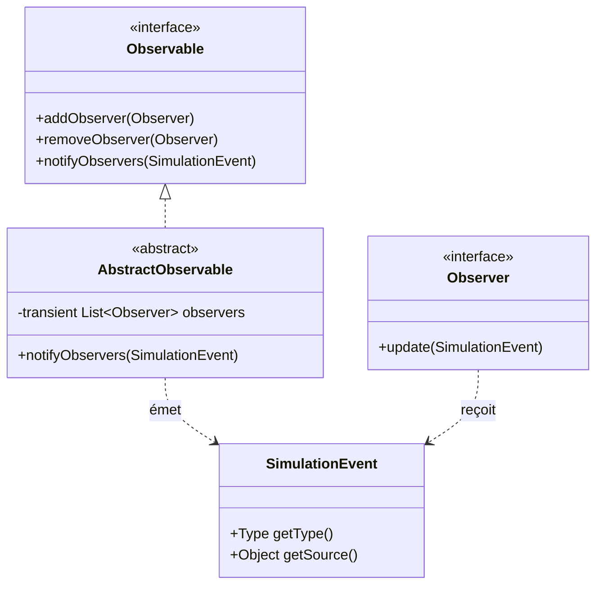
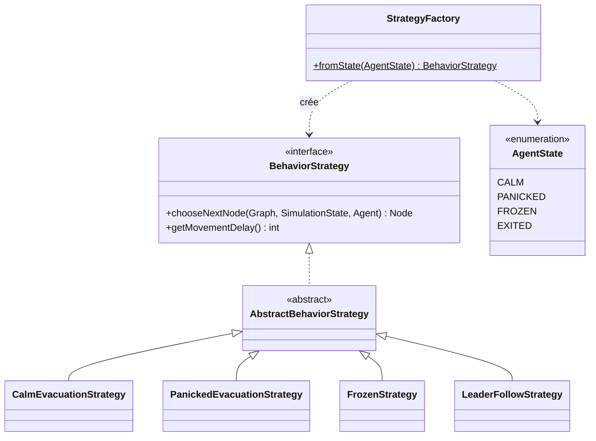
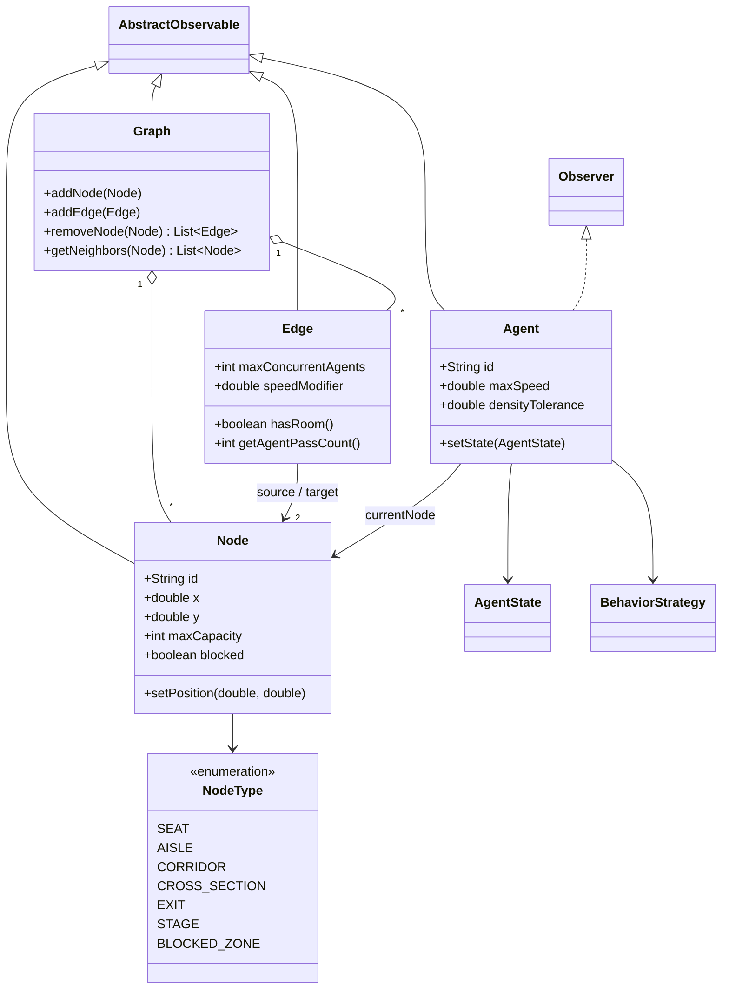
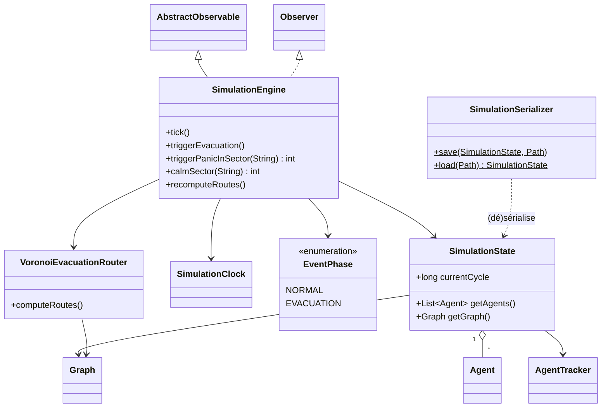
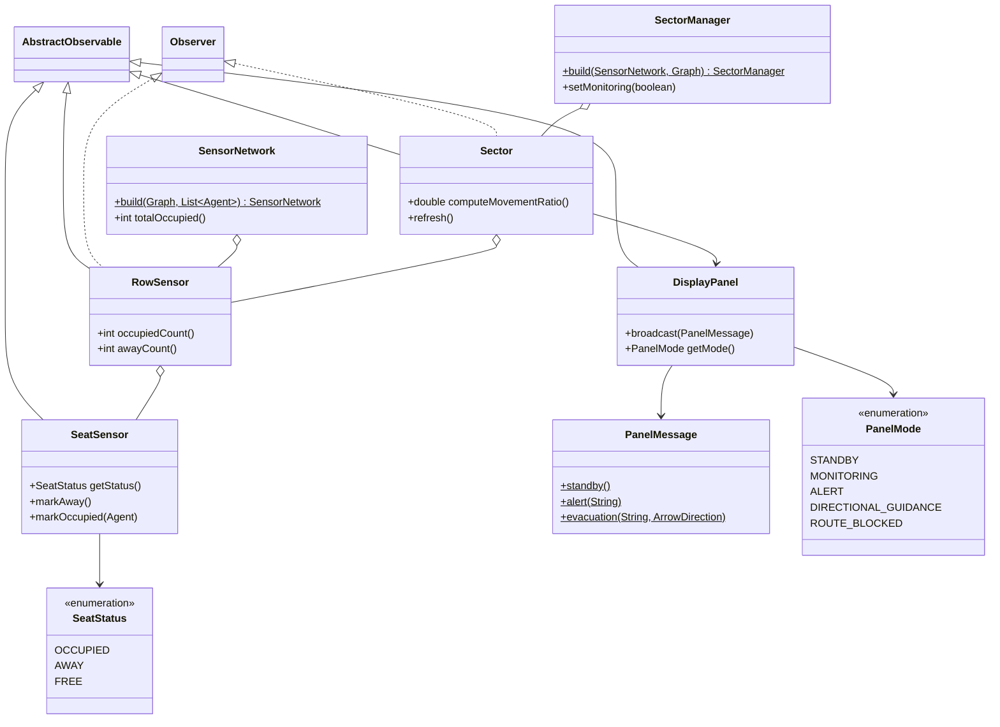
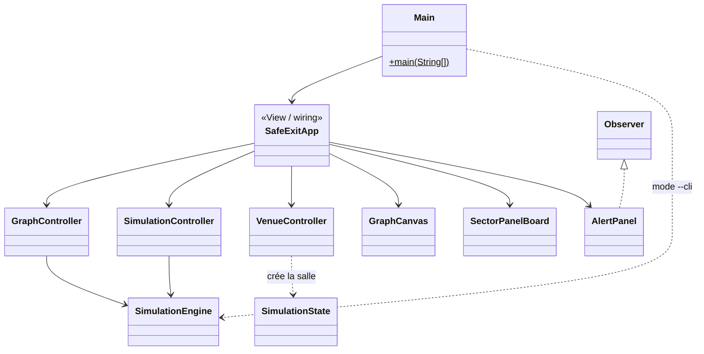

# SafeExit — Conception (diagrammes de classes UML)

Document de conception exigé par le cahier des charges. Les diagrammes sont écrits en **Mermaid** et s'affichent directement sur GitHub. Ils sont découpés par préoccupation pour rester lisibles.

> Convention : `<|--` héritage, `<|..` implémentation d'interface, `o--` agrégation, `-->` association/dépendance.

---

## 1. Patron Observer (cœur de la communication modèle → vue)

Chaque changement d'état du modèle émet un `SimulationEvent`. La vue, le routeur et les capteurs s'abonnent. Les observateurs sont `transient` (non sérialisés).

## 2. Patron Strategy (comportement des agents)

L'état d'un agent détermine sa stratégie de déplacement ; `StrategyFactory` fait la correspondance.

## 3. Modèle du graphe et agents

## 4. Simulation, routage et persistance

## 5. Capteurs, secteurs et panneaux (système centralisé)

## 6. Couches MVC (vue d'ensemble)

---

### Notes de conception

- **`AbstractObservable`** factorise tout le mécanisme Observer ; les classes du modèle (graphe, agents, capteurs, secteurs, moteur) en héritent. Les observateurs sont `transient` → la sérialisation ne sauvegarde que le modèle.
- **`SimulationState`** est un simple porteur de données (sérialisable) ; toute la logique vit dans **`SimulationEngine`**.
- Le **routeur Voronoï** part des sorties comme sources d'un Dijkstra multi-sources : chaque nœud connaît sa sortie la plus proche (cellule de Voronoï) et son « prochain saut ».
- La couche **capteurs → secteurs → panneaux** est entièrement pilotée par événements (`SEAT_STATE_CHANGED` → `ROW_OCCUPANCY_CHANGED` → mise à jour du secteur et de son panneau).
